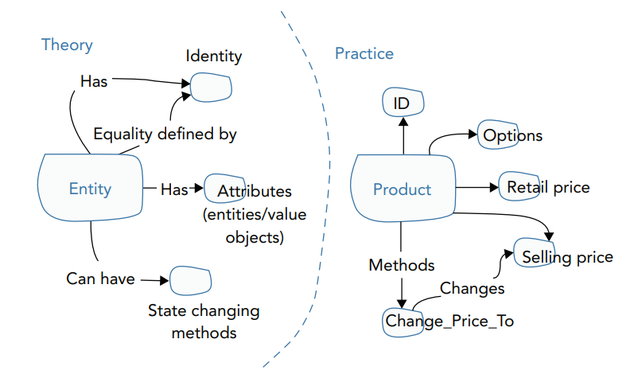
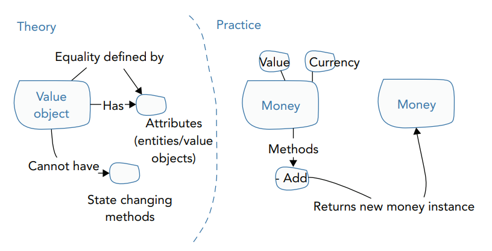

## Domain Driven Design Building Bolcks

### Основные компоненты-принципы-паттерны Объектно Ориентированного Проектирования

1) `Entity`

    - Entity - это основной компонент в DDD, который определяется своим уникальным идентификатором, а не атрибутами. То есть два User-а, как сущности, считаются различными, только если у них разные идентификаторы. При этом атрибуты у них могут быть одинаковыми (имя + фамилия)

    - У Entity могут меняться атрибуты, но id остается константным до завершения жизненного цикла сущности. Например: сущность User может сменить свою фамилию, или поменять пароль

    - Хороший тон использовать в качестве атрибутов Value Objects

        

2) `Value Object`

    - Value Object представляет из себя кирпичик, из которого состоит Entity

    - Value Object идентифицируется своими атрибутами, а не идентификатором! Это самое основное отличие от Entity. Два почтовых адреса, как Value Object равны только тогда, когда у них одинаковое *почтовое имя*, *домен сервера* и *домен страны*

    - Value Object всегда Immutable. Пример: если пользователь хочет поменять свой почтовый адрес, то он удаляет старый VO и создает новый VO с новыми атрибутами

        

3) `Domain Service`

    -

4) `Aggregate`

5) `Factory`

6) `Repository`

7) `Domain Event`

8) `Event Sourcing`